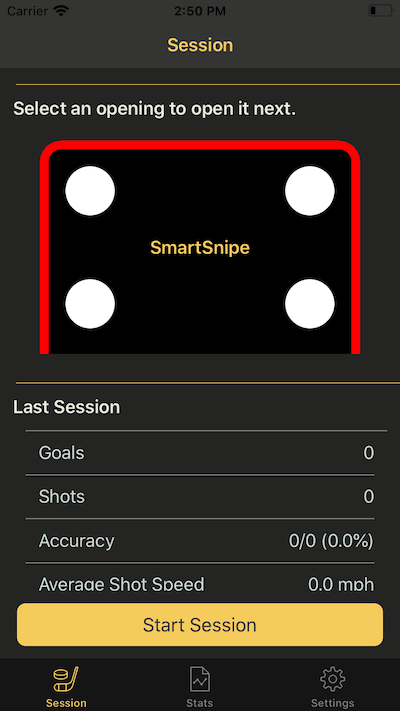

**SmartSnipe FYDP**

SmartSnipe is the Capstone project of five University of Waterloo Mechanical/Mechatronic engineering students including myself. The goal of SmartSnipe is to allow hockey players to improve their hockey shot and make practicing their shot more like real game situations. 

SmartSnipe is a smart shooter tutor with doors that open and close to simulate a real game. The shooting board is equipped with a radar gun, reaction time sensors, a camera for computer vision analysis and an iOS app to control the board and to view statistics. This Github repo is for the iOS application. I was the only person who worked on the iOS App. The main features of the iOS applcation are to change the settings on the board such as how long a door will open for and to display the player's stats such as average shot speed. 

**Main Technologies Used in iOS App:** Swift, CoreBluetooth, CoreData and MVVM design patterns.

CoreBluetooth was used to communicate with an NVIDIA Jetson computer that is onboard the hockey net.

CoreData was used to persist all of the relevent data and statistics on the user's device since we don't have a server.

MVVM was used because it helps reduce MVC (Massive View Controllers).  

---
**Screenshots**

---
